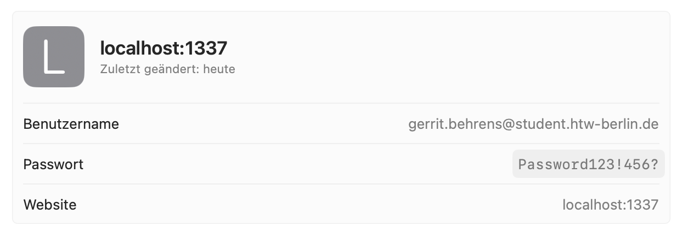
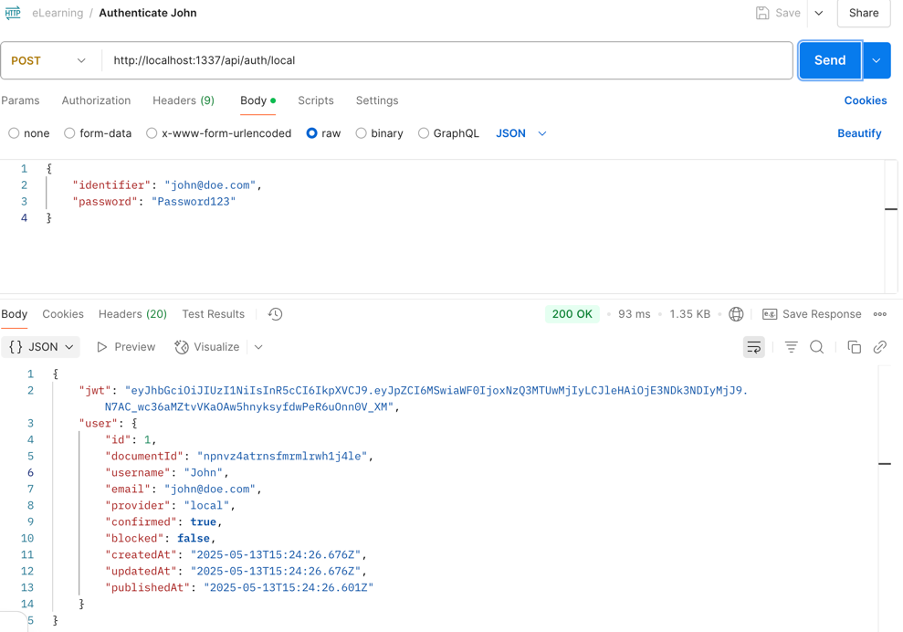

# Server of the eLearning

## Getting started - TODO
Before you can start you have to make sure that your installed and used Node.js-Version is between 18.X.X and 22.X.X. This is necessary to run the Headless CMS Strapi. <br> <br>
Run `npm run dev` to start the Strapi GUI. To login, you can create your own user or login with: <br>


Credentials: 
Username: gerrit.behrens@student.htw-berlin.de
Password: Password123!456?


## Data model

In this section the data model is described. <br>
The following Entities are used in the application: <br>

- User
- Unit
- Section
- Lecture
- Test
- Explanation
- Task

In the following chapters the entities are documented.
The code in each chapter is mongodb-json that is used in our db-schema.

## User

The **User** object consist out of the following fields:<br>
```mongodb-json
{
	"username": string,
	"email": { type: String, lowercase: true, required: [true, "can't be blank"], match: [/^[^@\s]+@[^.@\s]+(.[^.@\s]+){1,2}$/], trim: true, unique: true },
	"password": string,
	"unitProgress": [
		{
			"unitId": string,
			"progress": number
		}
	],
	"sections": [string],
	"testDone": [string]
}
```

## Unit
The **Unit** object contains the following fields: <br>
```mongodb-json
{
	title: {type: string, required: [true, "can't be blank"]},
	description: string,
	sections: [Section],
	estimatedTime: string
}
```

## Section
The **Section** object contains the following fields: <br>
```mongodb-json
{
	title: {type: string, required: [true, "can't be blank"]},
	description: string,
	lectures: [Lecture],
	estimatedTime: string,
	relatedUnitId: string
}
```

## Lecture
The **Lecture** object contains the following fields: <br>
```mongodb-json
{
	title: {type: string, required: [true, "can't be blank"]},
	description: string,
	relatedSectionId: string,
	content: [Object]	
}
```
With the type Object the following types **Explanation** and **Task** are meant.

## Test
The **Test** object only contains the actual content of test. (Collection of type Task) <br>
```mongodb-json
{
	title: {type: string, required: [true, "can't be blank"]},
	description: string,
	relatedUnitId: string,
	content: [Task]	
}
```

## Explanation
The **Explanation** object contains the actual content the learner should learn.
Therefore, it's structure varies related to the following types.

### Video
In this case the field type has to contain the string "video".
```mongodb-json
{
	type: string,
	title: string,
	linkSrc: string,
	transcript: string
}
```

### Text
In this case the field type has to contain the string "text".
```mongodb-json
{
	type: string,
	title: string,
	content: string
}
```

### TextImage
In this case the field type has to contain the string "txtImg". <br>
The **imgSrc** field contains the binary data of the image that should be displayed next to the text. <br>
The **orientation** field should only contain the two strings **leading** or **trailing**. This describes the order of img and text. Leading means IMG | TEXT and trailing TEXT | IMG on one page.
```mongodb-json
{
	type: string,
	title: string,
	imgSrc: {
            data: { type: String },
            size: { type: Number },
            mimetype: { type: String }
    },
    text: string,
    orientation: string
}
```

### codeExplanation
In this case the field type has to contain the string "codeExpl". <br>
The **code** field contains the code that should be displayed in a code block. <br>
The **explanation** field contains the text that explains the given code in more detail.
```mongodb-json
{
	type: string,
	title: string,
	code: string,
	explanation: string
}
```

## Task
The **Task** object contains the actual content of a task a learner should solve.
It's actual structure varies related to the following types.

### Free text answer
```mongodb-json
{
	question: string,
	answer: string,
	points: int
}
```

### Multiple-Choice
```mongodb-json
{
    question: string,
    possibleAnswers: [string],
    correctAnswers: [string],
    points: int,
}
```

### Single-Choice
```mongodb-json
{
    question: string,
    possibleAnswers: [string],
    correctAnswer: string,
    points: int
}
```

### Fill the gap - Drag and drop
It is very important that the **textWithGaps** field contains the tasks text with separators like "gap",
where the gap can be place in the front end. When submitting the task the filled gaps are compared with the solution text.
```mongodb-json
{
    question: string,
    textSnippets: [string],
    gapTextsInOrder: [string],
    solutionText: string,
    points: int
}
```

### Mark the correct lines
**ExampleCode** is given in separated lines. Each array entry is on line of the code.
The **solutionLines** property passes the correctLines, that should be marked.
```mongodb-json
{
	question: string,
	exampleCodePerLine: [string],
	solutionLines: [int],
	points: int
}
```

### Code
The **givenCode** field contains the code that is given to the student. <br>
The **testToExecute** field contains the test code that should be executed to test rather the students answer is correct or not.
```mongodb-json
{
    type: string,
    question: string,
    givenCode: [string],
    testToExecute: string,
    points: int
}
```

## Authentication
The authentication of an end user is done via a POST request to http://url/api/auth/local. The request body should be build like the following: <br>

```json
{
  "identifier": "email or username",
  "password": "password123!"
}
```

If the credentials where correct we get a response with the user object itself and a JWT for further requests that need authentication.


## Population
To get all nested elements including dynamic zones from a GET-Request we can use the following url paramters: <br>
```
base_url/api/contents?populate[0]=content&populate[1]=content.possibleAnswers&populate[2]=content.correctAnswers&populate[3]=content.correctLines&[4]textSnippets=content.textSnippets&[5]gapTexts=content.gapTexts&[6]exampleCodePerLine=content.exampleCodePerLine&[7]solutionLines=content.solutionLines&[8]correctAnswer=content.correctAnswer
```

## ⚙️ Deployment

Strapi gives you many possible deployment options for your project including [Strapi Cloud](https://cloud.strapi.io). Browse the [deployment section of the documentation](https://docs.strapi.io/dev-docs/deployment) to find the best solution for your use case.

```
yarn strapi deploy
```

## 📚 Learn more

- [Resource center](https://strapi.io/resource-center) - Strapi resource center.
- [Strapi documentation](https://docs.strapi.io) - Official Strapi documentation.
- [Strapi tutorials](https://strapi.io/tutorials) - List of tutorials made by the core team and the community.
- [Strapi blog](https://strapi.io/blog) - Official Strapi blog containing articles made by the Strapi team and the community.
- [Changelog](https://strapi.io/changelog) - Find out about the Strapi product updates, new features and general improvements.

Feel free to check out the [Strapi GitHub repository](https://github.com/strapi/strapi). Your feedback and contributions are welcome!

## ✨ Community

- [Discord](https://discord.strapi.io) - Come chat with the Strapi community including the core team.
- [Forum](https://forum.strapi.io/) - Place to discuss, ask questions and find answers, show your Strapi project and get feedback or just talk with other Community members.
- [Awesome Strapi](https://github.com/strapi/awesome-strapi) - A curated list of awesome things related to Strapi.